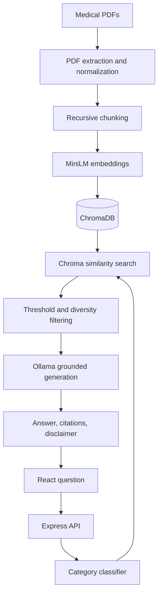

# AI Medical Knowledge Assistant using RAG

An educational medical knowledge assistant that answers questions from a locally supplied collection of PDF documents. The application uses local embeddings, ChromaDB vector search, automatic medical-category routing, and a local Ollama language model to produce grounded answers with document and chunk citations.

> **Medical disclaimer:** This project provides educational information from the supplied documents. It does not provide diagnoses, prescriptions, dosage recommendations, or personalized treatment, and it does not replace professional medical advice, diagnosis, or treatment. Do not use real patient data or protected health information (PHI) with this learning project.

## Features

- Processes six locally supplied educational medical PDFs.
- Extracts and normalizes PDF text while preserving paragraph boundaries.
- Splits documents into overlapping chunks with LangChain's recursive text splitter.
- Generates 384-dimensional local embeddings with `Xenova/all-MiniLM-L6-v2`.
- Stores embeddings, text, and metadata in a local ChromaDB collection.
- Automatically classifies questions into one or more medical categories.
- Supports manual category selection from the React interface.
- Retrieves, filters, and diversifies relevant document chunks.
- Generates answers locally with Ollama and `llama3.2:3b`.
- Returns document names, chunk numbers, categories, and similarity scores.
- Refuses unsupported questions when no sufficiently relevant context is found.
- Includes backend validation, safety prompting, and a static medical disclaimer.
- Includes automated API, category-classifier, and chunking tests.

## Architecture



## RAG request flow

1. The user enters a question and optionally selects a medical category.
2. If no category is selected, deterministic rules and Ollama classify the question.
3. MiniLM converts the question into a normalized 384-dimensional vector.
4. ChromaDB retrieves semantically similar document chunks.
5. A relevance threshold removes weak matches.
6. Diversity rules limit how many chunks a single document can contribute.
7. Retrieved text and metadata are assembled into a controlled prompt.
8. Ollama generates an answer using only the supplied context.
9. Express returns the answer, citations, and disclaimer to React.

## Technology stack

### Frontend

- React 19
- TypeScript
- Vite
- React Markdown
- Fetch API

### Backend

- Node.js
- Express 5
- TypeScript with NodeNext modules
- `pdf-parse`
- LangChain text splitters
- Vitest and Supertest

### Local AI and retrieval

- Hugging Face Transformers.js
- `Xenova/all-MiniLM-L6-v2`
- ChromaDB
- Ollama
- `llama3.2:3b`

## Medical documents

Medical PDF files are not included in this repository. Before running document processing, place your own legally obtained educational PDFs in the root `documents/` directory using these filenames:

| Required filename | Category |
| --- | --- |
| `asthma-action-plan.pdf` | Asthma |
| `blood-pressure-guide.pdf` | Hypertension |
| `cholesterol-guide.pdf` | Cholesterol |
| `diabetes-guide.pdf` | Diabetes |
| `diabetes-prevention.pdf` | Diabetes |
| `heart-health-guide.pdf` | Heart Health |

The filenames and categories are configured in `server/src/scripts/processDocuments.ts`. Use only documents that you have permission to use. Never add medical records, patient data, or PHI.

## Project structure

```text
medical-rag-assistant/
├── client/
│   ├── src/
│   │   ├── pages/AssistantPage.tsx
│   │   ├── services/api.ts
│   │   ├── types/rag.ts
│   │   ├── App.tsx
│   │   └── main.tsx
│   └── package.json
├── documents/
│   └── .gitkeep             # PDFs are supplied locally and not committed
├── server/
│   ├── data/                # generated JSON files are not committed
│   ├── src/
│   │   ├── controllers/ragController.ts
│   │   ├── routes/ragRoutes.ts
│   │   ├── scripts/
│   │   │   ├── processDocuments.ts
│   │   │   └── local/
│   │   ├── services/
│   │   │   ├── local/
│   │   │   ├── chunkingService.ts
│   │   │   └── pdfService.ts
│   │   ├── types/document.ts
│   │   ├── utils/normalizeText.ts
│   │   ├── app.ts
│   │   └── server.ts
│   ├── package.json
│   └── tsconfig.json
├── chroma-data/             # generated locally; not committed
└── README.md
```

The backend application code is under `server/src`, with document-processing scripts, retrieval services, API controllers, and automated tests organized by responsibility.

## Prerequisites

- Node.js 20.19 or newer
- npm
- Ollama for Windows, macOS, or Linux
- Python 3.9 or newer for running the local ChromaDB server
- Enough disk space to store the Ollama model, MiniLM model cache, and Chroma data

The project was developed with Node.js 24.

## Environment variables

From the project root, create the server `.env` from the safe template:

```powershell
Copy-Item .\server\.env.example .\server\.env
```

The template contains:

```env
PORT=5000
CLIENT_ORIGIN=http://localhost:5173

CHROMA_HOST=localhost
CHROMA_PORT=8000
CHROMA_COLLECTION_NAME=medical-documents

OLLAMA_BASE_URL=http://localhost:11434
OLLAMA_CHAT_MODEL=llama3.2:3b
```

Create the client `.env` from its safe template:

```powershell
Copy-Item .\client\.env.example .\client\.env
```

The template contains:

```env
VITE_API_BASE_URL=http://localhost:5000
```

Never commit `.env` files or credentials.

## Installation

Install backend dependencies:

```powershell
cd server
npm install
cd ..
```

Install frontend dependencies:

```powershell
cd client
npm install
cd ..
```

Install the local ChromaDB server in an isolated Python environment. From the project root:

```powershell
py -m venv .chroma-venv

.\.chroma-venv\Scripts\python.exe `
  -m pip install --upgrade pip

.\.chroma-venv\Scripts\python.exe `
  -m pip install chromadb
```

Confirm that the Ollama model is installed:

```powershell
ollama list
```

If necessary:

```powershell
ollama pull llama3.2:3b
```

## Process and index the documents

Place the six PDFs in the root `documents` directory using the required filenames shown above. From the project root, run:

```powershell
cd server
npm run process-documents
```

Start ChromaDB from the project root in a separate terminal:

```powershell
.\.chroma-venv\Scripts\chroma.exe run `
  --host localhost `
  --port 8000 `
  --path .\chroma-data
```

In another terminal, open the project root and index the chunks:

```powershell
cd server
npm run index-local-documents
```

Re-run document processing and indexing whenever the source PDFs or text-normalization/chunking logic changes. Indexing uses upsert operations, so stable chunk IDs are updated instead of duplicated.

## Files excluded from Git

The following files and directories are generated locally or may contain machine-specific configuration and must not be committed:

```text
.env
node_modules/
.chroma-venv/
client/dist/
server/dist/
server/data/*.json
chroma-data/
documents/*.pdf
```

Commit the safe `.env.example` templates and `documents/.gitkeep` placeholder instead.

## Run the application

Use separate terminals for the services.

### 1. Ollama

Ollama normally runs in the background. If necessary:

```powershell
ollama serve
```

Default address: `http://localhost:11434`

### 2. ChromaDB

From the project root:

```powershell
.\.chroma-venv\Scripts\chroma.exe run `
  --host localhost `
  --port 8000 `
  --path .\chroma-data
```

Default address: `http://localhost:8000`

### 3. Express backend

```powershell
cd server
npm run dev
```

Address: `http://localhost:5000`

### 4. React frontend

```powershell
cd client
npm run dev
```

Address: `http://localhost:5173`

## API

### Health check

```http
GET /api/health
```

Example response:

```json
{
  "success": true,
  "message": "Medical RAG server is running."
}
```

### Ask a medical question

```http
POST /api/rag/ask
Content-Type: application/json
```

Request:

```json
{
  "question": "What are asthma warning signs?",
  "category": "Asthma"
}
```

The category is optional. An empty or omitted category enables automatic classification.

Response shape:

```json
{
  "success": true,
  "answer": "Asthma warning signs may include...",
  "citations": [
    {
      "documentId": "asthma-action-plan",
      "documentName": "asthma-action-plan.pdf",
      "category": "Asthma",
      "chunkIndex": 53,
      "score": 0.6339
    }
  ],
  "disclaimer": "This assistant provides educational information..."
}
```

Unsupported categories and empty questions return HTTP `400`. Unknown endpoints return HTTP `404`.

## Retrieval configuration

The local RAG service currently uses:

| Setting | Value |
| --- | ---: |
| Initial retrieval candidates | 25 |
| Results per detected category | 4 |
| Maximum context chunks | 10 |
| Maximum chunks per document | 4 |
| Minimum cosine similarity | 0.45 |
| Chunk size | 1,200 characters |
| Chunk overlap | 200 characters |

These values are development defaults and should be evaluated against a representative question set before production use.

## Safety behavior

- Answers are restricted to retrieved document context.
- The prompt prohibits diagnosis, prescriptions, dosage changes, and personalized treatment.
- Unsupported questions return a fixed not-found response with no citations.
- Category values are validated by the API.
- A relevance threshold prevents weak chunks from reaching the LLM.
- A static disclaimer is included in every response.
- Emergency messaging is displayed separately in the React interface.
- No real patient data is used.

Safety prompts and similarity thresholds reduce unsupported answers but do not guarantee medical correctness. Human review and stronger clinical governance would be required for real healthcare use.

## Testing

### Automated tests

From `server`:

```powershell
npm run type-check
npm test
```

The minimum automated suite covers:

- Express health and not-found endpoints
- Empty-question and invalid-category validation
- Successful API response with a mocked RAG service
- Deterministic single-category and multi-category routing
- Blood-pressure reading classification
- Chunk creation, metadata, empty input, and invalid overlap

### Manual integration tests

These scripts require some or all local AI services:

```powershell
npm run test:embedding
npm run test:chroma
npm run test:search -- "What are asthma symptoms?"
npm run test:ollama
npm run test:rag -- "How can diabetes be prevented?"
```

Recommended safety test:

```powershell
npm run test:rag -- "How do I repair a car engine?"
```

Expected behavior: the assistant returns the fixed not-found response and an empty citation list.

## Build verification

Backend:

```powershell
cd server
npm run type-check
npm test
npm run build
```

Frontend:

```powershell
cd client
npm run lint
npm run build
```

## Current limitations

- The knowledge base is a fixed collection of six documents.
- There is no admin upload or document-management interface.
- Citations identify documents and chunk indexes, not PDF page numbers.
- Responses are not streamed to the browser.
- Local inference speed depends on the user's hardware.
- Conversation history and authentication are not implemented.
- The project is not validated for clinical or production use.

## Portfolio summary

Developed an end-to-end educational Medical RAG Assistant using React, TypeScript, Node.js, Express, MiniLM embeddings, ChromaDB, and Ollama. Implemented PDF processing, recursive chunking, vector indexing, automatic multi-category routing, relevance filtering, diversified retrieval, grounded generation, citations, safety fallbacks, REST APIs, and automated tests.

## License and usage

This repository is an educational portfolio project. Review the licenses and usage terms of all source documents, models, and dependencies before redistributing or deploying it.
